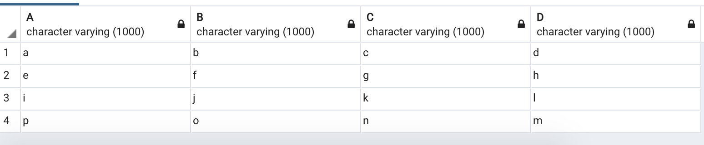
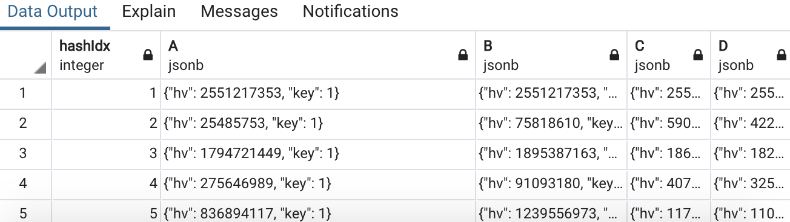
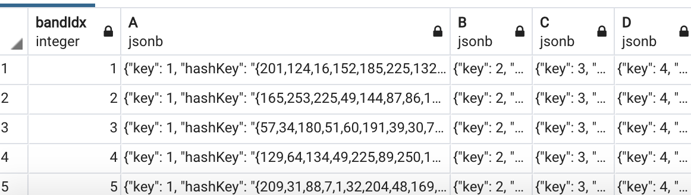

### Implement LSH Ensemble in Postgres

**Indexing**
- A raw table is like the one following where *A*, *B*, *C*, *D* are domains. This table is called `public.df0`

- We first compute the minHash values of each domain/ column in order to construct the signature matrix. The code for this part is in `construct_sig.sql`. In the file, we first declare a function `min_hash_char` that takes in an object of type *character varying* in the raw table as its first argument, the length of the string as the third argument, and the index of the hash function as the 3rd argument. The actual function `min_hash_char` is written in C and loaded into Postgres through this declaration. The source code can be found in `user-defined funcs/funcs.c` and `minhash.c`. In the same `construct_sig.sql` file, we also declare another function `insert_sig` that takes in the number of hash function as the only argument and insert the signatures into `public.sig_table`. Instead of storing the minHash value as an *bigint*, using type *jsonb* is preferable because it allows to store other states such as `key` and `size`.

- From here, we can construct `public.hash_table` used for querying purposes. The code for building this table can be found in `sig_table.sql`. First of all, we declare the function `min_hash_array` that takes in part of a signature vector of a domain and returns a new hash key. Details of this function in C can be found in the function `min_hash_array_new` in `funcs.c` as well as `util_funcs.c` where I defined a function that converts a number into a byte array. Then, there is the function `insertHash` that actually does the insertions. I used **hashIdx** defined in `public.sig_table` in order to select certain rows from the table to form a band (with this, I can specify a range for **hashIdx** using the `WHERE` conditions). Similar to how we structure the `public.sig_table`, in the hash table, we also use *jsonb* in order to keep some other states.

**Query**

There are two parts to perform a query: 1) find the optimal `k` (the number of hash functions) and `l` (the number of bands) 2) use the params calculated to loop through each band/ bucket and find signatures that have the same **hashKey** and collect their `key` (each `key` is the unique ID of a domain).
1. the calculation of optimal `k` and `l` is already done in `lshforst.c` and `probability.c`
2. still need to finish the second part...