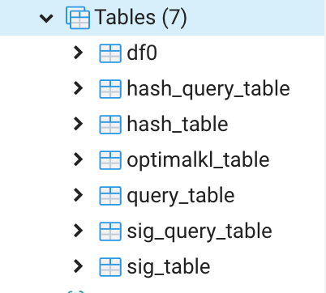

### Implement LSH Ensemble in Postgres

**Indexing**
- A raw table is like the one following where *A*, *B*, *C*, *D* are domains. This table is called `public.df0`

- We first compute the minHash values of each domain/ column in order to construct the signature matrix. The code for this part is in `construct_sig.sql`. In the file, we first declare a function `min_hash_char` that takes in an object of type *character varying* in the raw table as its first argument, the length of the string as the third argument, and the index of the hash function as the 3rd argument. The actual function `min_hash_char` is written in C and loaded into Postgres through this declaration. The source code can be found in `user-defined funcs/funcs.c` and `minhash.c`. In the same `construct_sig.sql` file, we also declare another function `insert_sig` that takes in the number of hash function as the only argument and insert the signatures into `public.sig_table`. Instead of storing the minHash value as an *bigint*, using type *jsonb* is preferable because it allows to store other states such as `key` and `size`.

- From here, we can construct `public.hash_table` used for querying purposes. The code for building this table can be found in `sig_table.sql`. First of all, we declare the function `min_hash_array` that takes in part of a signature vector of a domain and returns a new hash key. Details of this function in C can be found in the function `min_hash_array_new` in `funcs.c` as well as `util_funcs.c` where I defined a function that converts a number into a byte array. Then, there is the function `insertHash` that actually does the insertions. I used **hashIdx** defined in `public.sig_table` in order to select certain rows from the table to form a band (with this, I can specify a range for **hashIdx** using the `WHERE` conditions). Similar to how we structure the `public.sig_table`, in the hash table, we also use *jsonb* in order to keep some other states.

**Query**

In addition to the indexing the query table which is similar to what we have done above, there are two additional tasks we have to complete: 1) compute the optimal `k` (the number of hash functions) and `l` (the number of bands) 2) use the `optK` and `optL` values to loop through each band/ bucket and find signatures that have the same **hashKey** and collect their `key` (each `key` is the unique ID of a domain).
- We first initialize a table of query domain as seen in the following table. The approach for querying a single domain also works for multiple query domains because we can just consider each domain separately. For simplicity, I just created a single domain as an illustration here.

- Then, we follow the same techniques of minHashing and grouping by band index to construct `public.sig_query_table` and `public.hash_query_table`. Source code can be found in `query/sig_query_table.sql` and `query/hash_query_table.sql` respectively.

This is the signature matrix for the query table

This is the hash matrix for the query table

- The only difference here is that we introduce `optK` when constructing the hash table (instead of using the regular `k`). To do this, we first check whether we have `optK` for a given set of parameters in `public.optimalkl_table`. If not, we calculate it upfront and later insert it into `public.optimalkl_table` for future re-use. Otherwise, we simply take it from the table. The source code for calculating `optK` and `optL` can be found in `probability.c`

- With everything prepared, we can now do our actual querying. The source code is in `query/query.sql`. We first join `public.hash_query_table` and `public.hash_table` on `bandIdx`. Column `qd` refers to the query domain and the other columns come from the corpus of tables that we intend to search over. We just go through the number of rows specified by `optL` and check if `qd` is contained by any of the `hashKey` of domain *A*, *B*, *C* or *D*. The length of arrays in `qd` is different from the arrays in other columns, so here, we only use the first `prefixSize` elements in the arrays from domain *A*, *B*, *C* or *D* (i.e. we would only use `ls[:prefixSize]` for arrays from these domains if the array is called `ls`). We will append the `key` of the domain to the return set if the above condition is matched. Using these `key`, we can retrieve the joinable domains.

**Partition**

This is a typical structure of tables we will need for using LSH Ensemble:
- `df0` is the table we intend of search over
- `sig_table` is the signature matrix derived from `df0`
- `hash_table` is the hash table derived from `sig_table`
- `query_table` is the table of query domains
- `sig_query_table` is the signature matrix derived from `query_table`
- `hash_query_table` is the hash table constructed from `sig_query_table`
- `optimalkl_table` is used to store the `optK` and `optL` values under different parameters

The one thing we haven't implemented yet is partitioning the corpus of tables we intend to search over. But essentially, this is pretty much just duplicating what we have done, just that after partitioning, we would have more `sig_table` and `hash_table`. But the core technqiues remains the same.